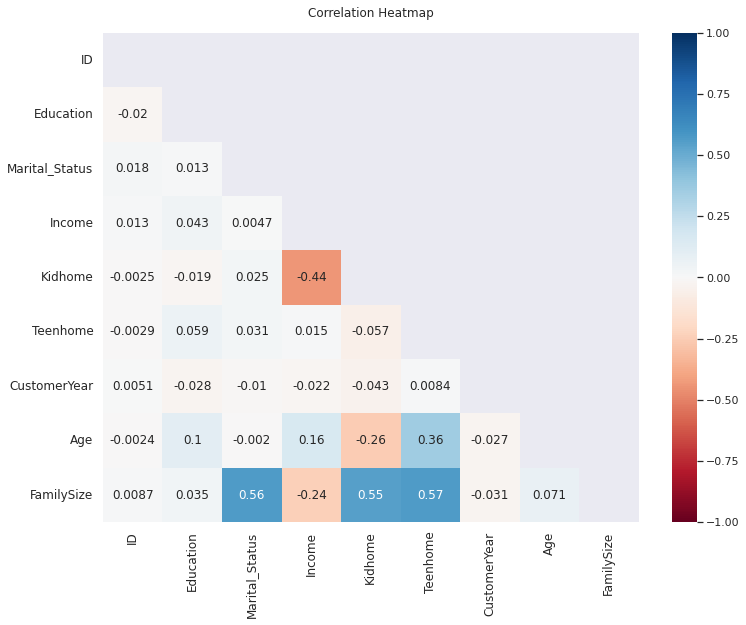
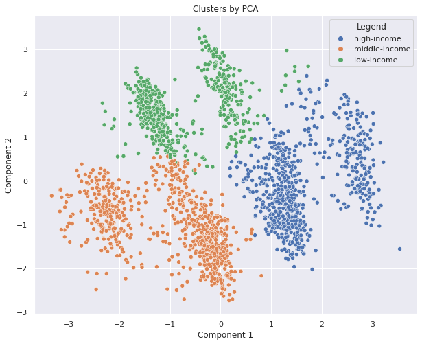
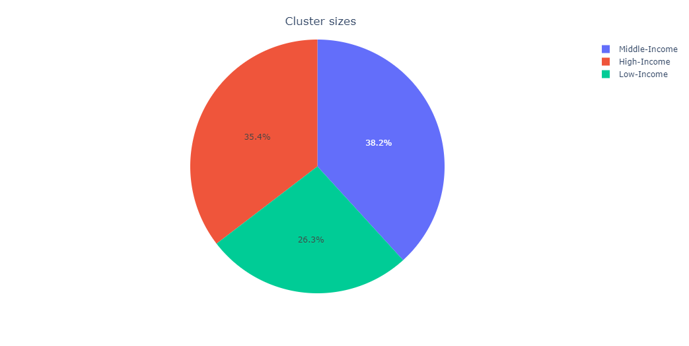

# Customer_Segmentation

The goal of this project is to segment customers based on their demographics using methods such as K-means clustering and principal component analysis. Each segment will then be analyzed separately to reveal the buying patterns of each customer segment, how much they are benefiting from the campaigns, and where the buying process is taking place in general.

## Data

#### Customer

* ID: Customer's unique identifier
* Year_Birth: Customer's birth year
* Education: Customer's education level
* Marital_Status: Customer's marital status
* Income: Customer's yearly household income
* Kidhome: Number of children in customer's household
* Teenhome: Number of teenagers in customer's household
* Dt_Customer: Date of customer's enrollment with the company
* Recency: Number of days since customer's last purchase
* Complain: 1 if the customer complained in the last 2 years, 0 otherwise

#### Products
 
* MntWines: Amount spent on wine in last 2 years
* MntFruits: Amount spent on fruits in last 2 years
* MntMeatProducts: Amount spent on meat in last 2 years
* MntFishProducts: Amount spent on fish in last 2 years
* MntSweetProducts: Amount spent on sweets in last 2 years
* MntGoldProds: Amount spent on gold in last 2 years

#### Promotion
 
* NumDealsPurchases: Number of purchases made with a discount
* AcceptedCmp1: 1 if customer accepted the offer in the 1st campaign, 0 otherwise
* AcceptedCmp2: 1 if customer accepted the offer in the 2nd campaign, 0 otherwise
* AcceptedCmp3: 1 if customer accepted the offer in the 3rd campaign, 0 otherwise
* AcceptedCmp4: 1 if customer accepted the offer in the 4th campaign, 0 otherwise
* AcceptedCmp5: 1 if customer accepted the offer in the 5th campaign, 0 otherwise
* Response: 1 if customer accepted the offer in the last campaign, 0 otherwise

#### Place
 
* NumWebPurchases: Number of purchases made through the company’s website
* NumCatalogPurchases: Number of purchases made using a catalog
* NumStorePurchases: Number of purchases made directly in stores
* NumWebVisitsMonth: Number of visits to company’s website in the last month

## Visual EDA

## Preprocessing data

* Rows with missing data were removed from the dataset.
* The categories in the education feature changed to undergraduate and graduate.
* The categories in the marital status feature changed to single and couple.
* Numerical features KidHome and Teenhome changed to categorical features.
* Family size feature added.

## K-means clustering with PCA

# Analysis of final clusters

**Middle-Income:**
* With 843 customers, this segment constitutes 38.2% of the total customers.
* 48% are at the graduate level, while 52% are at the graduate level.
* 83.5% are a couple while 16.5% are single.
* 47.8% have children at home, 52.2% do not.
* 100% have teens at home.
* Of this segment, 21.6% have been customers for 10 years, 53% for 9 years, and 25.4% for 8 years.
* 62.8% have families of 3, while 33.5% have families of 4
* The average income of this segment is around 69000.
* The average age of this segment is around 57 years.

**High-Income:**
* With 781 customers, this segment constitutes 35.4% of the total customers.
* 53.3% are at the graduate level, while 46.7% are at the postgraduate level.
* 42.1% are a couple while 57.9% are single.
* 0.4% have children at home, 99.6% do not.
* 26.6% have teens at home, 73.4% do not.
* Of this segment, 23.7% have been customers for 10 years, 52.2% for 9 years, and 24.1% for 8 years.
* 69% have families of 2, while 30.9% have families of 1
* The average income of this segment is around 51000.
* The average age of this segment is around 57 years.

**Low-Income:**
* With 581 customers, this segment constitutes 26.3% of the total customers.
* 59.6% are at the graduate level, while 40.4% are at the postgraduate level.
* 67% are a couple while 33% are single.
* 90% have children at home, 10% do not.
* 2.6% have teens at home, 97.4% do not.
* Of this segment, 21% have been customers for 10 years, 53.5% for 9 years, and 25.5% for 8 years.
* 59.7% have families of 3, while 36.3% have families of 2
* The average income of this segment is around 30000.
* The average age of this segment is around 44 years.

In general, I tried to show what was done in the project. If you want to examine it in more detail, <a href = 'https://www.kaggle.com/code/gokberkyucelkaya/customer-segmentation'>you can reach the notebook here.</a>
